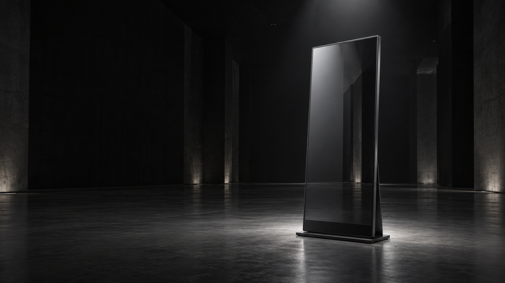

# Hero 대표 이미지 — 웅장한 공간 콘셉트

2026-10-05 사용자 확정 방향에 따른 이미지 시안. 사이트 전체를 어둡게 바꾸는 결정은 아니다.

## 용도

- 심사위원·관람객에게 4-Fit MirrorTing을 소개하는 첫 화면 대표 이미지.
- 어두운 넓은 공간, 스마트 미러 한 대, 절제된 조명.
- 이미지에는 글자를 넣지 않는다. 왼쪽 여백에 웹페이지에서 작품명·CarpeDM·메인 카피·버튼을 얹는다.
- 확정 메인 카피: “실전에서 처음 겪지 않도록, 직장생활의 순간을 미리 경험하게 합니다.”
- 실제 장치를 촬영한 사진이 아닌 AI 생성 콘셉트 이미지다. 장치 제작·통합 상태의 증거로 쓰지 않는다.
- 이후 사용자 요청에 따라 첫 화면에 적용했다. WebP 파생본을 런타임에서 사용하며 PNG 원본은 유지한다. 공개 배포는 아직 진행하지 않았다.

## 생성 방식

내장 Imagegen 도구로 한 장 생성. 프롬프트 원문은 아래에 기록한다.

## 결과

- 파일: `public/media/mirrorting-hero-monumental-v1.png`
- 1672 × 941 px, 가로 16:9에 가까운 비율.
- 미러 한 대를 오른쪽에 두고 왼쪽에 카피를 얹을 어두운 여백을 확보했다.
- 미러 전체와 받침대, 중성 조명, 넓은 공간, 텍스트·로고 없음은 생성 결과를 직접 확인했다.
- 첫 화면 적용 뒤 360·390 px 크롭과 768·1440 px 구성, 문구 및 CTA 배치를 브라우저에서 확인했다. 실제 휴대폰과 느린 네트워크의 로딩 시간은 미검증이다.



## 최종 프롬프트

```text
Use case: product-mockup.
Asset type: one cinematic landscape 16:9 website hero concept image for 4-Fit MirrorTing, a physical smart mirror exhibition project.
Primary request: a majestic yet restrained single smart mirror in an immense dark architectural space, lit with minimal carefully controlled light. Premium, clean, credible product presentation, quiet monumental scale.
Scene/backdrop: spacious empty charcoal-black exhibition hall, very high ceiling dissolving into darkness, a continuous matte graphite floor and dark background with subtly visible architectural depth, no furniture or decoration. No visible venue signage.
Subject: exactly ONE freestanding tall vertical rectangular smart mirror, realistic large display proportions approximately 9:16 for the mirror face, slender black metal frame, softly reflective dark glass, discreet lower sensor area and a low stable black floor stand. Three-quarter front angle. Entire object and stand in frame, product edges clearly legible. Screen blank, reflective glass catching a subtle neutral architectural highlight, no interface, no illuminated graphics.
Composition/framing: wide landscape 16:9 image. Mirror on the right half around 68 percent horizontal position, occupying about 65 percent image height. Left 45 percent contains calm dark negative space suitable for adding Korean headline and buttons later in HTML. Balanced composition; depth and scale come from the vast empty space and grounded perspective. Do not crop the mirror. Keep extra breathing room above and around object. Camera at human eye level with restrained perspective.
Lighting/mood: one soft neutral-white overhead light grazing the frame and glass, subtle rim light separating object from backdrop, a modest soft pool of light beneath the mirror. Realistic contact shadow, very subtle floor reflection. Rich tonal detail in shadows, no crushed product details. Sober, confident, monumental, understated.
Style/medium: high-end architectural product visualization, physically plausible materials, original concept render with photoreal finish. This is conceptual imagery, not documentation of completed hardware.
Color palette: nearly black and charcoal, neutral silver highlights, no neon colors.
Constraints: absolutely no text, lettering, numbers, logos, watermark, people, additional mirrors, kiosk, plants, furniture, floating objects, AI orbs, sci-fi holograms, fake dashboard, UI, luminous circuit patterns, hard laser beams, fog clouds or dramatic blue glow. Do not render webpage copy into the image. Generate only the scene image, not a website screenshot.
```
